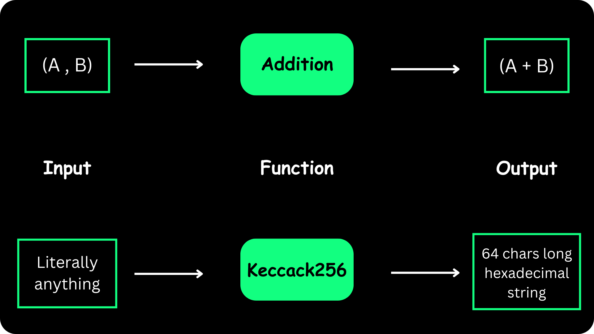
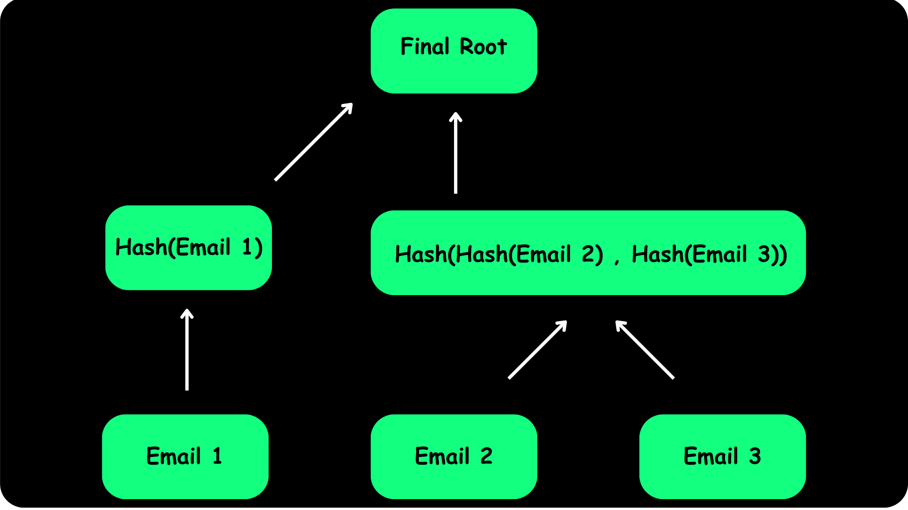

# Merkle Trees: what, why and how?

Merkle Trees are essentially an inspired take on Binary Trees, a foundational data structure in computer science.
What sets Merkle Trees apart is their unique ability to verify the integrity of large data sets without revealing or storing the underlying data.
Additionally, they excel in facilitating rapid data lookups.

This is possible because of the way Merkle Trees are structured. They leverage cryptographic hashing to create a unique hash for each node in the tree. Each hash is unique but they all have the same length.
This consistent uniqueness means no hash can be used to identify the data it represents, but can be used to verify its integrity.

This was a whole lot of jargon. Let us take a step back and take a closer look at the underlying cryptographic magic that makes all of this possible.

## Hashing functions

A function is anything that provides a consistent output for a given input. For example, consider simple addition. The addition function will always produce the output `5` for given inputs `2` and `3`.

Keccak256 is one of many cryptographic hash functions in use today. It is a one-way function, meaning it is easy to compute the output for a given input, but impossible to compute the input for a given output. This is what makes it so useful for cryptography.
The Ethereum blockchain as a whole relies on Keccak256 for its security.

The main point of interest for us is that Keccak256 produces a unique 256-bit/32-byte/64-hexadecimal-character hash for each input. This means that no two inputs can produce the same output. This is called collision resistance.

<p align="center">
  
</p>

>📝  **Note:**
> You could build a Merkle Tree using any hashing function of your choice, but we will be using Keccak256 for this tutorial.

## What will we be building?

In this tutorial we will be be building a Merkle Tree built using three Email addresses. We will then use this Merkle Tree to check if a given Email address is part of the tree or not.

To get started:

1. Open your terminal in a new directory where you want to create your project.
2. Run `npm init -y` to initialize a new Node.js project.
3. Install Typescript as a dev dependency by running `npm install --save-dev typescript`.
4. Create a `tsconfig.json`file and fill it with the following data:
 
```json
{
    "compilerOptions": {
        "target": "es5",
        "lib": ["es2020", "dom"],
        "module": "commonjs",
        "strict": true,
        "esModuleInterop": true
    },
    "include": ["src/**/*"],
    "exclude": ["node_modules"]
}
```

5. Create a `src` directory in the root of your project, and a `MerkleTree_Implementation.ts` file inside it. Paste this simple console log into the file:

```typescript
    console.log("Hello from Merkle Tree!");
```

6. Inside the `package.json` file, add the following line to the `scripts` object:

```json
    "scripts": {
        "start": "tsc && node src/MerkleTree_Implementation.js"
    }
``` 

7. Run npm start to start a node process. If everything was done correctly, you should see the console statement printed in the terminal.

8. Run  `npm install merkletreejs` and `npm install ethers@5.7.2` to install the MerkleTree.js and ethers.js libraries respectively.
We will also need the `@types/node` to work with the different types of data we will be using. Run `npm install --save-dev @types/node` to install it as a dev dependency.

## Constructing our Merkle Tree

Inside `MerkleTree_Implementation.ts`, import the `MerkleTree` and `keccak256` functions from the libraries we just installed. We also need to import the `toUtf8Bytes` function from ethers.js to convert string data to bytes.
This is because the keccak256 function only accepts bytes as an input.

```typescript
import { MerkleTree } from 'merkletreejs'
import { keccak256, toUtf8Bytes } from "ethers/lib/utils";
```

Next, declare a function that returns a Merkle Tree. We will be using this function to construct our Merkle Tree.

```typescript
export async function generateMerkleTree(): Promise<MerkleTree> {

  let whitelist = [
    "randomEmail_1_@gmail.com",
    "randomEmail_2_@gmail.com",
    "randomEmail_3_@gmail.com",
  ];

  // Leaves are the actual data points that make up a Merkle Tree
  const leaves = whitelist.map((email) => keccak256(toUtf8Bytes(email)));

  const merkleTree = new MerkleTree(leaves, keccak256, {sortPairs: true});

  const root = merkleTree.getHexRoot();

  console.log("The Merkle Root is:", root);
  console.log("Printing the whole Merkle tree:", merkleTree.toString());

  return merkleTree;
}
```

Let us break down what is happening here:

1. We declare an array of Email addresses called `whitelist`. This is the data we will be using to construct our Merkle Tree.
2. The `map` function allows us to map each element of the `whitelist` array to a new array called `leaves`. This new array contains the hashed version of each Email address.
3. We then use the `MerkleTree` constructor to create a new Merkle Tree. The constructor takes three arguments:
    - `leaves`: The array of hashed Email addresses we just created.
    - `keccak256`: The hashing function we will be using to hash our data.
    - `{sortPairs: true}`: This is an optional argument that sorts the leaves by value before starting the hashing process. This means the Merkle Tree will always be constructed in the same way, regardless of the order of the leaves.
4. We then use the `getHexRoot` function to get the root of the Merkle Tree. This is the hash of the entire Merkle Tree. We will be using this to verify the integrity of our data.
5. Finally, we use the `toString` function to print the entire Merkle Tree to the console.

## Verifying our Merkle Tree

One of the primary uses of a Merkle Tree is to verify whether a particular piece of data (in our case, an email address) is part of the original dataset without revealing the entire dataset.
How does that work though?

Before we make sense of that, let us take a look into how the Merkle Tree is structured.
Take a look at this diagram:

<p align="center">
  
</p>

1. In a Merkle Tree, the path from any leaf (data point) to the root can be represented by a series of hashes.
2. This series of hashes is referred to as the "Merkle proof" for that leaf. The Merkle proof, combined with the original data point, allows anyone to recompute the Merkle root.
3. If the recomputed root matches the original root, it proves that the data point is indeed part of the tree.

For example, for `Email 1`, the proof will be `Hash(Hash(Email 2) , Hash(Email 3))`, for that is what you need to get the final root.
Conversely, for `Email 2`, the proof will consist of `Hash(Email 3)`, to get to the second layer, which will then need to be combined with `Hash(Email 1)` to get the final root.

Let us now implement this in code. Add the following function to `MerkleTree_Implementation.ts`:

```typescript
export function verifyEmail(email: string, tree: MerkleTree): boolean {

  // Convert the email to its hashed form
  const leaf = keccak256(toUtf8Bytes(email));

  // Get the Merkle Proof for the email
  const proof = tree.getHexProof(leaf);

  // Verify the proof
  const isValid = tree.verify(proof, leaf, tree.getHexRoot());

  return isValid;
}
```

1. The function takes two params: The actual Email you want to verify, along with an instance of the MerkleTree object.
2. We then convert the Email to its hashed form using the `keccak256` function.
3. Next, we use the `getHexProof` function to get the Merkle proof for the Email.
4. Finally, we use the `verify` function to verify the proof. This function takes three arguments:
    - `proof`: The Merkle proof for the particular leaf.
    - `leaf`: The hashed Email address.
    - `root`: The Merkle root.

## Putting it all together

Now that we have all the pieces in place, let us put it all together and see how it works. Add the following code to the bottom of `MerkleTree_Implementation.ts`:

```typescript
function main() {

  const tree = generateMerkleTree();
  const emailToVerify = "randomEmail_1_@gmail.com";

  if (verifyEmail(emailToVerify, tree)) {
    console.log(`${emailToVerify} is part of the tree.`);
  } else {
    console.log(`${emailToVerify} is NOT part of the tree.`);
  }
}

main();
```

1. We first call the `generateMerkleTree` function to generate a new Merkle Tree.
2. We then declare a variable called `emailToVerify` and assign it the value of the Email address we want to verify.
3. Finally, we call the `verifyEmail` function to verify whether the Email address is part of the tree or not.

Thus, we can check if a given Email address is part of the tree or not.

## Wrapping up

This was a lot. In this article we learned about Merkle Trees, how they work, and how to build one using an existing library.
We used a Merkle Tree to verify whether a given Email address is part of a dataset without revealing the entire dataset.
Think about how powerful this is!

By constructing a Merkle Tree from an array of email addresses, we can establish a whitelist for a product launch. Subsequently, we can verify if a specific email address is on that whitelist without disclosing the entire list. This ensures both privacy and exclusivity.

You can find the full code for this tutorial [on our Github page](https://github.com/Genesis3800/SafeGlobal_MerkleTree/blob/main/src/MerkleTree_Implementation.ts).

To keep up with more cool tutorials like these, make sure to follow our blog.
